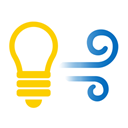

# 照明空調操作
**照明空調操作**はオフィスの照明と空調を操作するPersonal Field Controlシステム専用のアプリケーションです。
NFCタグから読み取った場所にあわせてスマートフォンから照明と空調を操作します。

## 機能
### iPhone版
- デスクに設置したNFCタグをスキャンして読み取った位置の照明と空調を操作します。

### iPad版
- アプリに登録した各フロアの位置情報からフロア内のグループやデスク位置を選択して、その場所の照明と空調を操作します。

## 使い方
### 照明と空調の操作
- アプリを起動すると自動的にNFCをスキャンする機能が立ち上がります。
- デスクなどに設置されているNFCタグをスキャンします。
- 画面上部にはスキャンした場所が表示されます。
- 照明の「明るさ」と「色」および空調の「風量」をボタンで操作します。

## 設定
### 接続先サーバーの設定
- アプリ画面右上の歯車アイコンをタップして表示される設定画面から「サーバー」を選択してサーバー画面を開きます。
- 画面下部の「QRコードのスキャン」をタップしてサーバー設定用のQRコードを読み取ります。
- サーバー設定用のQRコードは管理者から提供されます。

## プライバシーポリシー

[Privacy Policy](https://ziotreks.github.io/FieldControlSupport/PrivacyPolicy/)

## コンタクト
Email: support@ziotreks.com

-----
Ziotreks株式会社

Copyright 2024 Ziotreks Ltd.
